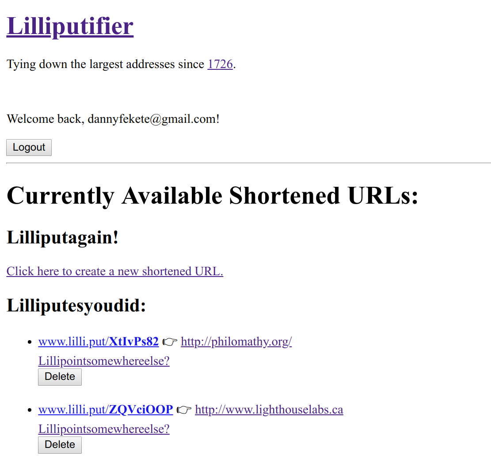
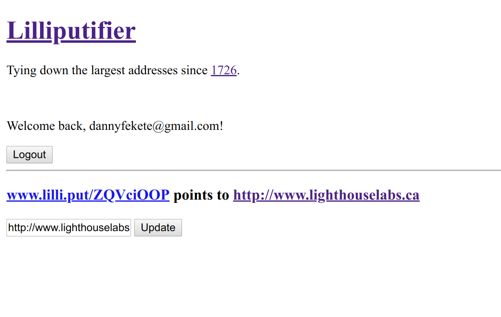

# Lilliputifier:
###### Tying down the largest addresses since [1726](https://en.wikipedia.org/wiki/Lilliput_and_Blefuscu)
Created by Danny Fekete
[Lighthouse Labs:](https://www.lighthouselabs.ca/) Project #2 ("TinyApp")


## General:
My first full-stack web application: using [Express](https://expressjs.com/) as a framework and absolutely no CSS styling or other beautificaiton, this app is a clone of link-management services like [bitly.com](https://bitly.com/) and [goo.gl](https://goo.gl/).

## Screen Shots



## Features:
- User registration
  - Cookie encryption with [cookie-session](https://www.npmjs.com/package/cookie-session)
  - Password hashing and secure user authentication with [bcrypt](https://www.npmjs.com/package/bcrypt)
- Create new "Lilliputs" (shortened URL links to provided full URLs)
- Modify (only) your own Lilliputs
- Delete (only) your own Lilliputs
- View a list of your own Lilliputs
- Existing Lilliputs can be used by anyone
- 60% fewer Brobdingnagians than in the beta (ticket closed; if you want the rest, Phil, *you* deal with them.)

## Limitations:
- User and URL databases are simulated within `express-server.js` and are destroyed at shutdown.
- My god, it's ugly.

## Dependencies
- Node.js
- Express
- EJS
- bcrypt
- body-parser
- cookie-session

## Getting Started
- Install all dependencies
```
$ npm install
```
- Run the development web server
```
$ node express_server.js
```


###### Last updated 2018-09-08
